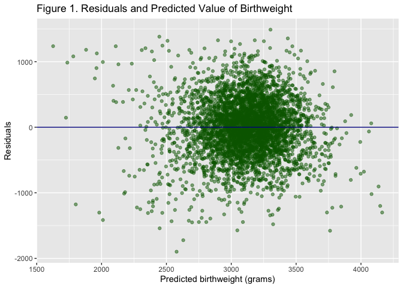

Homework 5
================
Amelia Zhao
2019-11-25

## Problem 1

Load and clean data:

    ## [1] "./data"

    ## [1] 0

In my regression model for birthweight, I chose variables that are
clinically relevant, and that women may be interested in knowing about.
For example, SES status is known to affect innumerous health outcomes.
I’m interested in maternal health, specifically in examining the
effect of a pregnant mother’s actions and prenatal health on post-natal
physiological outcomes. Thus, I’ve chosen variables that are related to
the mother’s prenatal health.

| term        |    estimate |   std.error |   statistic |   p.value |
| :---------- | ----------: | ----------: | ----------: | --------: |
| (Intercept) |   78.315226 | 113.5575395 |   0.6896524 | 0.4904498 |
| delwt       |    7.632071 |   0.6414703 |  11.8977774 | 0.0000000 |
| fincome     |    1.760883 |   0.2736307 |   6.4352530 | 0.0000000 |
| gaweeks     |   57.890044 |   2.1637845 |  26.7540707 | 0.0000000 |
| menarche    |  \-8.031097 |   4.6332582 | \-1.7333585 | 0.0831031 |
| momage      |    9.297781 |   1.8792251 |   4.9476674 | 0.0000008 |
| parity      |   92.642466 |  64.9404613 |   1.4265754 | 0.1537744 |
| ppbmi       | \-24.939552 |   4.0812054 | \-6.1108300 | 0.0000000 |
| smoken      |  \-8.060611 |   0.9021966 | \-8.9344291 | 0.0000000 |
| wtgain      |    2.171104 |   0.9114593 |   2.3820083 | 0.0172614 |

| r.squared | adj.r.squared |    sigma | statistic | p.value | df |    logLik |     AIC |      BIC |  deviance | df.residual |
| --------: | ------------: | -------: | --------: | ------: | -: | --------: | ------: | -------: | --------: | ----------: |
| 0.2717484 |     0.2702354 | 437.5141 |  179.6104 |       0 | 10 | \-32560.2 | 65142.4 | 65212.54 | 829225287 |        4332 |

<!-- -->

Comparison of my model to one using length at birth and gestational age
(Figure 2, Model 2), and one using head circumference, length, sex, and
all interactions thereof (Figure 2, Model 3).

| term        |     estimate | std.error |  statistic | p.value |
| :---------- | -----------: | --------: | ---------: | ------: |
| (Intercept) | \-4347.66707 | 97.958360 | \-44.38281 |       0 |
| blength     |    128.55569 |  1.989891 |   64.60439 |       0 |
| gaweeks     |     27.04673 |  1.717930 |   15.74379 |       0 |

| r.squared | adj.r.squared |    sigma | statistic | p.value | df |     logLik |      AIC |      BIC |  deviance | df.residual |
| --------: | ------------: | -------: | --------: | ------: | -: | ---------: | -------: | -------: | --------: | ----------: |
| 0.5768894 |     0.5766943 | 333.2174 |  2958.001 |       0 |  3 | \-31381.32 | 62770.64 | 62796.14 | 481775846 |        4339 |

| term                   |       estimate |    std.error |   statistic |   p.value |
| :--------------------- | -------------: | -----------: | ----------: | --------: |
| (Intercept)            | \-7176.8170221 | 1264.8397394 | \-5.6740920 | 0.0000000 |
| babysex2               |   6374.8683508 | 1677.7669213 |   3.7996150 | 0.0001469 |
| bhead                  |    181.7956350 |   38.0542051 |   4.7772811 | 0.0000018 |
| blength                |    102.1269235 |   26.2118095 |   3.8962180 | 0.0000992 |
| babysex2:bhead         |  \-198.3931810 |   51.0916850 | \-3.8830816 | 0.0001047 |
| babysex2:blength       |  \-123.7728875 |   35.1185360 | \-3.5244319 | 0.0004288 |
| bhead:blength          |    \-0.5536096 |    0.7802092 | \-0.7095656 | 0.4780117 |
| babysex2:bhead:blength |      3.8780531 |    1.0566296 |   3.6702106 | 0.0002453 |

| r.squared | adj.r.squared |    sigma | statistic | p.value | df |    logLik |      AIC |      BIC |  deviance | df.residual |
| --------: | ------------: | -------: | --------: | ------: | -: | --------: | -------: | -------: | --------: | ----------: |
|  0.684876 |      0.684367 | 287.7344 |  1345.616 |       0 |  8 | \-30741.6 | 61501.19 | 61558.58 | 358816655 |        4334 |

<!-- -->

# Models

As shown in Figure 2, my clinical, maternal-focused model is high in
prediction error, the highest of the three models. Although there is no
test and thus no statistical significance, my model clearly has a much
higher RMSE than the other models.

## Problem 2
